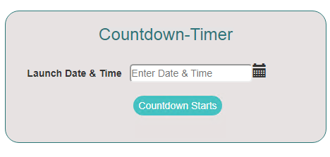

# Countdown Timer component Angular
Countdown Timer is a simple component, used to calculate countdown time between current system date&time and user given date&time. which is designed in angular.

<p align="center">
    
</p>

To preview demo of countdown-timer component, [Click here](https://angular-zul4c8.stackblitz.io)

## Using the complete angular component

Download the src folder from countdown-timer folder and install the required packages and run the application.

### Installing

```
> npm install
```

### Run server

```
> ng serve
```

## Adding countdown-timer component in your project
 Download the countdown-timer component from countdown-timer/src/app folder to your angular project and include required components from angular.

``` html

<app-countdown-timer></app-countdown-timer>

```
## How it works
  
   User enters date&time in the input field, will get that date&time and we will perform some operation and we will display the countdown-time in screen.
    

In this countdown-timer creation, we used @angular/forms and ng-pick-datetime dependencies.

